# Portafolio - Software Developer

## WarriorsDev
> - Soluciones pensadas en agilizar y facilitar la manera de operar en su empresa o negocio y a un bajo costo.
> - Tecnologías: | HTML | CSS | Javascript | PHP | MySQL |
- [Web Site](http://warriorsdev.com)

## FS Engineering & Consulting
> - Empresa de ingeniería y consultoría que ofrece servicios profesionales de ciclo completo basados en los mas altos estándares nacionales e internacionales para satisfacer la total satisfacción de nuestros clientes y empresas colaboradoras.
> - Tecnologías: | Wordpress | PHP | MySQL |
- [Web Site](http://fs-ec.mx/inicio/)

## SI XPRESS SA DE CV
> - Empresa dirigida al sector industrial con prestación de servicios ampliamente calificados y venta de productos de marcas altamente reconocidas a nivel mundial.
> - Tecnologías: | Wordpress | PHP | MySQL |
- [Web Site](http://sixpress.mx)

## Vendo Guaymas
> - Plataforma web para el comercio local.
> - Directorio de profesionales y negocios locales y regionales.
> - Tecnologías: | PHP | Mysql | API Rest |
- [Plataforma Web](http://vendoguaymas.com/index.php)
- [Aplicación Móvil]()

## Xalala: Authentication / Business
> - Authentication: Registro de puntos por juego.
> - Business: Sistema de recompensas por negocio y registro por puntos para cambiarlo beneficios.
> - Android: | Kotlin | MVP | Retrofit | Module Games | Crashlytics | Authentication | Cloud Messaging |
> - API: | PHP | MySQL | REST API | JWT |

- [Google Play Store](https://play.google.com/store/apps/details?id=mx.xalala.app)
 

|  |  |  |
| ---------------------------------------------- | -------------------------------------------- | ------------------------------------------- |

|  |  |  |
| ---------------------------------------------- | -------------------------------------------- | ------------------------------------------- |

|  |  |  |
| ---------------------------------------------- | -------------------------------------------- | ------------------------------------------- |

## Sudoku
> - Sudoku: Para los amantes de los puzzles de todos los niveles. Tanto si eres un principiante como un experto, encontrarás un sinfín de diversión y desafíos.
> - Android: | Kotlin | SOLID | Data Store | Jetpack Compose | Dagger Hilt | MVVM |
- [Google Play Store](https://play.google.com/store/apps/details?id=com.warriorsdev.sudoku)
 

|  |  |  |
| ---------------------------------------------- | -------------------------------------------- | ------------------------------------------- |

## Battle Dooz: Tres en raya
> - El juego Simple es la variante más sencilla del Tres en raya, con una cuadrícula de tres por tres y dos jugadores. 
> - El jugador que consiga colocar tres de sus marcas en horizontal, vertical o diagonal es el ganador. 
> - El tamaño de la cuadrícula del tablero de juego varía de tres por tres a siete por siete, dificultad de la IA del juego variable (fácil, media, difícil)
> - Android: | Kotlin | SOLID | Data Store | Jetpack Compose | MVVM |
- [Google Play Store](https://play.google.com/store/apps/details?id=com.warriorsdev.battle.dooz)
 

|  |  |  |
| ---------------------------------------------- | -------------------------------------------- | ------------------------------------------- |

## Buscando Palabras
> - Este juego de búsqueda de palabras hace que aprender palabras nuevas sea tan fácil y mucho más divertido. Flexiona tu cerebro, conecta las letras y desliza tu camino a través de diversos rompecabezas de palabras, mientras aumentas constantemente tu vocabulario y confianza para los desafíos que te esperan.
> - Android: | Kotlin | SOLID | Retrofit | Dagger Hilt | MVVM | Share Preferences |
> - API: | PHP | MySQL | REST API | JWT |
- [Google Play Store](https://play.google.com/store/apps/details?id=com.warriorsdev.wordsearch)
 

|  |  |  |
| ---------------------------------------------- | -------------------------------------------- | ------------------------------------------- |

## AKL Games
> - Aplicación de multiples mini juegos.
> - Juegos Incluidos: | Coinflip | Vikings | ExplosionEmojis | Puzzle | Wordfind | SomonSay | DotsBoxes | Tetris | Snake | Basta | Memorama | Gato | Lottery |
- En Desarrollo
- [Google Play Store](https://play.google.com/store/apps/dev?id=7906574083418100097)
 

|  | ---------------------------------------------- |

## Turismo Sonora
> - Riqueza natural, cultural y lugares turísticos del Estado de Sonora .
> - El objetivo es difundir la riqueza natural, cultural e histórica del Estado de Sonora y sus lugares de interés turístico. 
> - Por ese motivo se requiere destacar sus atractivos particulares, así como la calidad de los servicios turísticos, a partir de estrategias promocionales, a efecto de incrementar el numero de turistas.
> - Android: | Kotlin | SOLID | Jetpack Compose | MVVM |
- En Desarrollo
- [Google Play Store](https://play.google.com/store/apps/dev?id=7906574083418100097)
 

|  |  |  |
| ---------------------------------------------- | -------------------------------------------- | ------------------------------------------- |

## InOut Registros
> - La aplicación para el registro de entradas y salidas de empleados de limpieza, creación de códigos QR para visitas a departamentos privados.
> - Tecnologías: | Kotlin | MVP | Share Preferences | QR Code |
- En Desarrollo
- [Google Play Store](https://play.google.com/store/apps/dev?id=7906574083418100097)
 

| 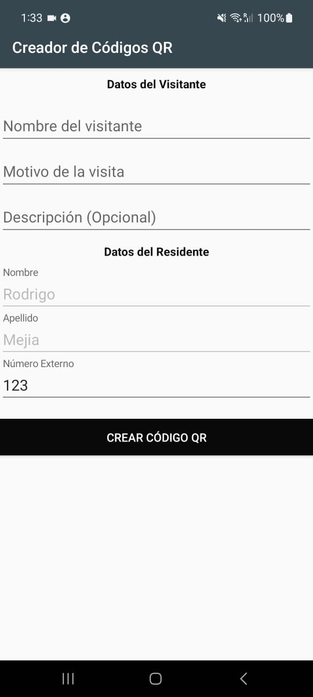 |  | 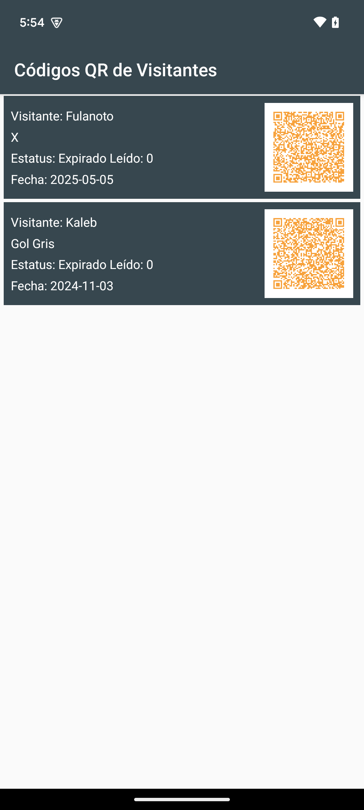 |
| ---------------------------------------------- | -------------------------------------------- | ------------------------------------------- |

## Kabla / Certum
> - Aplicación de multiples mini juegos.
> - Tecnologías: | React Native | PHP | Mysql | API Rest |
- **~~Deprecado~~**
- [Google Play Store](https://play.google.com/store/apps/developer?id=Kabla+Diagn%C3%B3sticos)
- [Apple Store](https://apps.apple.com/mx/app/certum/id1547320721)
- [Dashboard - QA](http://certum.warriorsdev.com/login.php)
 

| 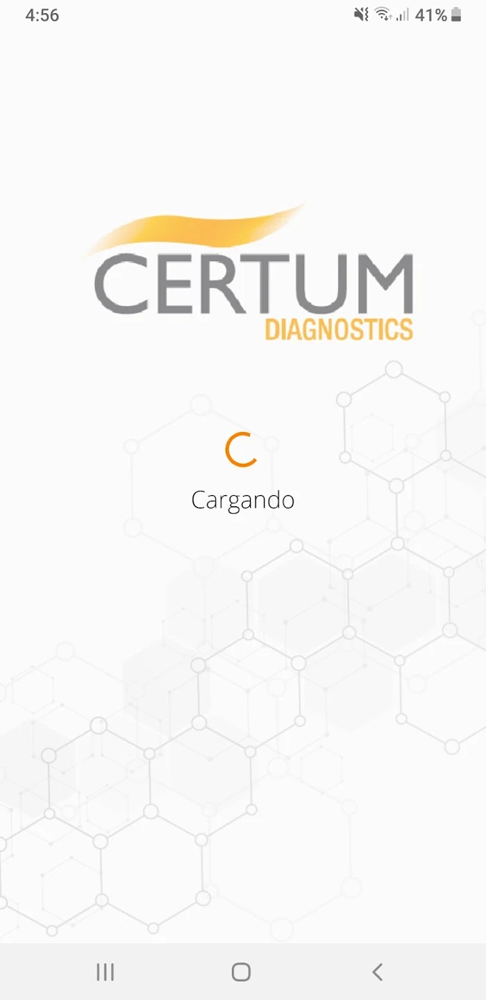 |  | 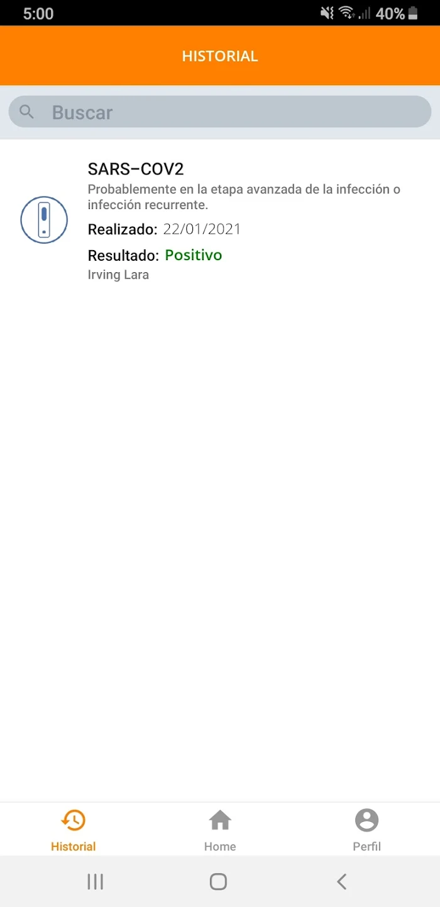 |
| ---------------------------------------------- | -------------------------------------------- | ------------------------------------------- |

## Mi Mercado En Casa
> - Aplicación para compras en mercados locales CDMX.
> - Tecnologías: | Kotlin | SOLID | ROOM | Share Preferences |
- **~~Deprecado~~**
- [Google Play Store](https://play.google.com/store/apps/details?id=com.warriorsdev.ito.customer.market)
 

| 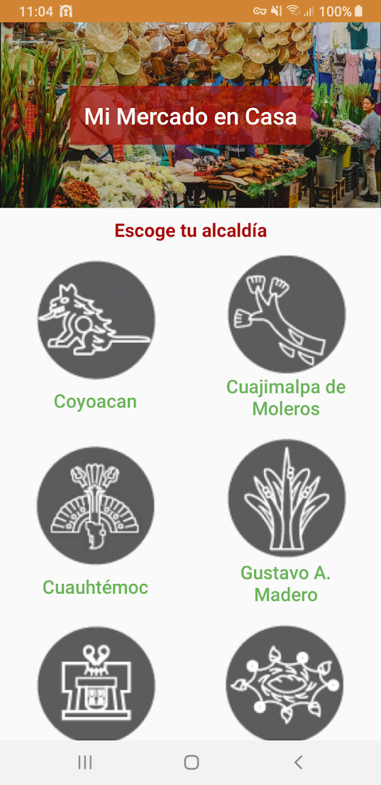 | 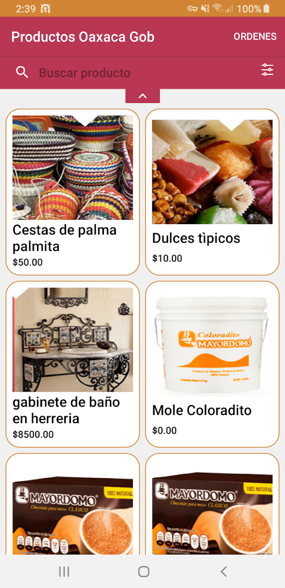 |  |
| ---------------------------------------------- | -------------------------------------------- | ------------------------------------------- |

## Donner
> - Aplicación Tipo Delivery.
> - Tecnologías: | Java/Kotlin | MVVM | Share Preferences |
- **~~Deprecado~~**
- [Google Play Store](https://play.google.com/store/apps/details?id=com.warriorsdev.donner)
 

| 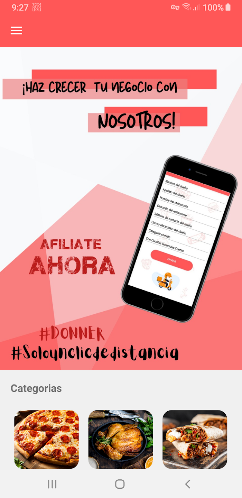 | 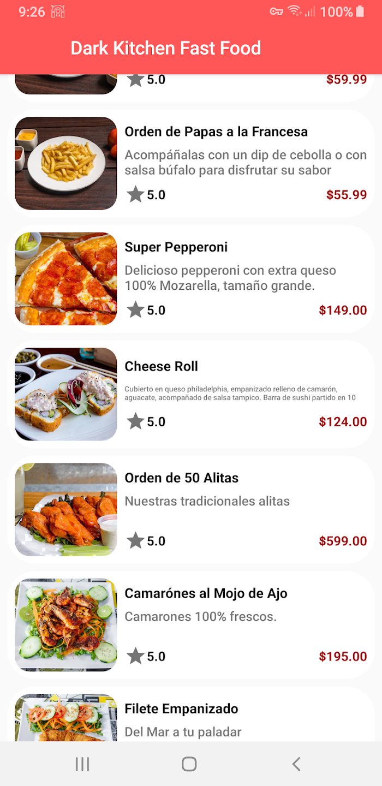 | 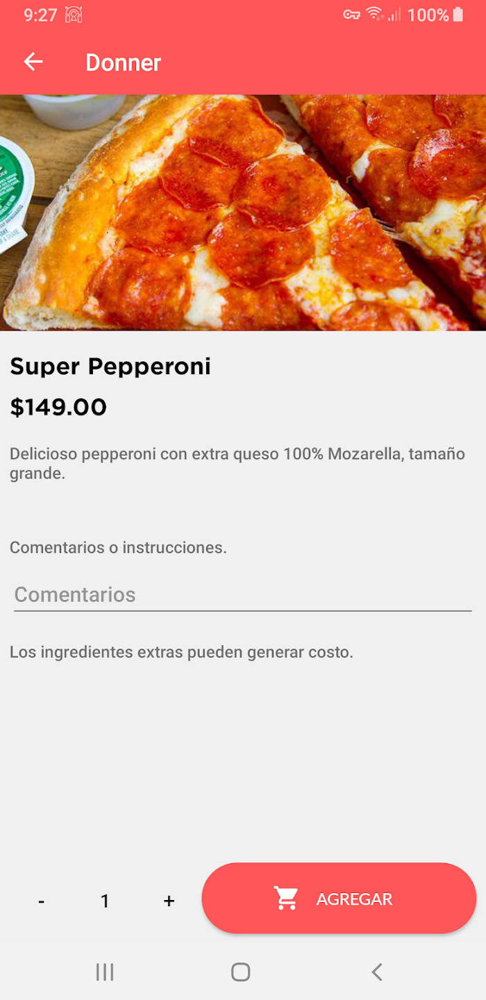 |
| ---------------------------------------------- | -------------------------------------------- | ------------------------------------------- |

## El Pirata Nadie
> - Es una aplicación para encontrar tesoros.
> - Patrocinadores de la marca, regalan tesoros (Descuentos en tiendas, Artículos para Gadgets, etc.), y que los exploradores pasen un agradable fin de semana en las búsquedas del Tesoro.
> - Tecnologías: | React Native | Node JS | MySQL | REST API|
- **~~Deprecado~~**
- [Google Play Store](https://play.google.com/store/apps/dev?id=7906574083418100097)
- [Apple Store]()
 

|  |  | 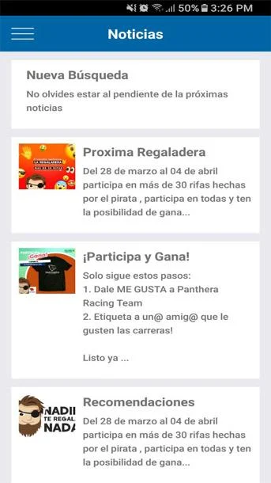 |
| ---------------------------------------------- | -------------------------------------------- | ------------------------------------------- |

## My Taxy - Customer/Driver
> - Aplicación para el cliente puede ver a los taxistas activos en el mapa,
trazar ruta y pedir un taxi.
> - Aplicación para el taxista, la cual siempre que está activo se muestra en
el mapa.
> - Tecnologías: | Java | MVP | PHP | MySQL | REST API|

- **~~Deprecado~~**
- [Google Play Store](https://play.google.com/store/apps/dev?id=7906574083418100097)
 

|  |  | 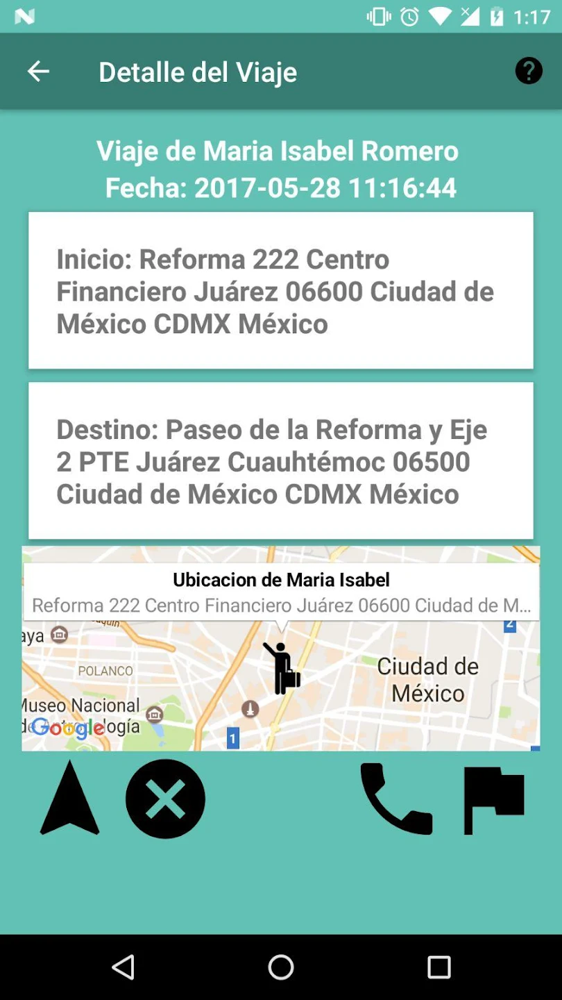 |
| ---------------------------------------------- | -------------------------------------------- | ------------------------------------------- |

| 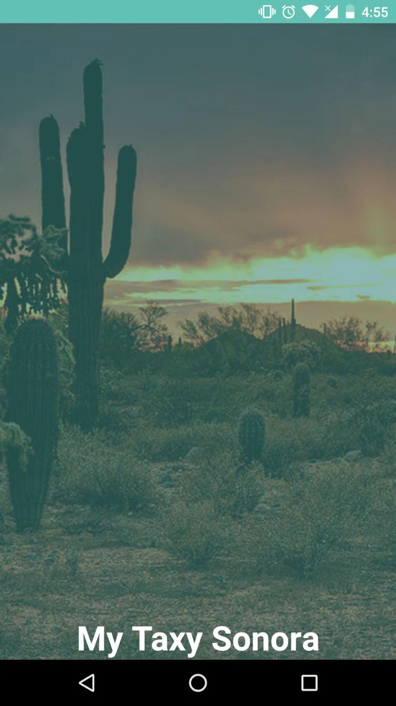 | 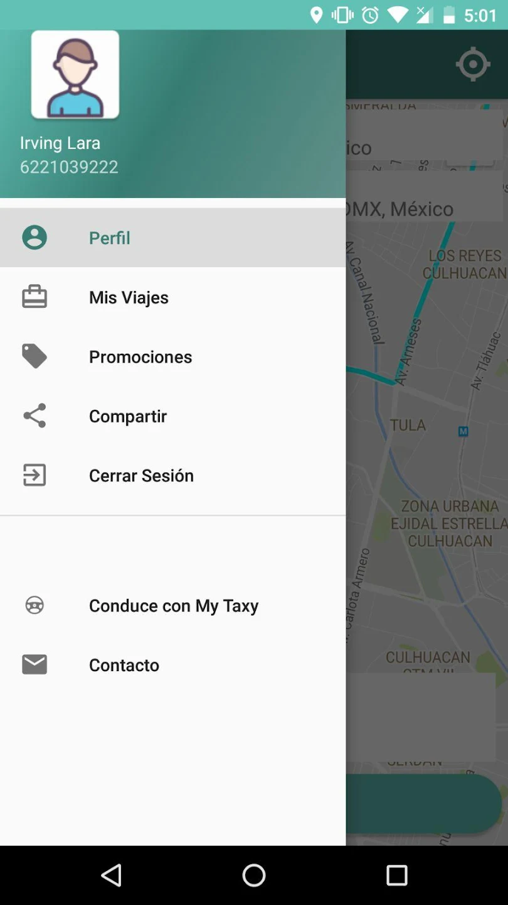 |  |
| ---------------------------------------------- | -------------------------------------------- | ------------------------------------------- |
